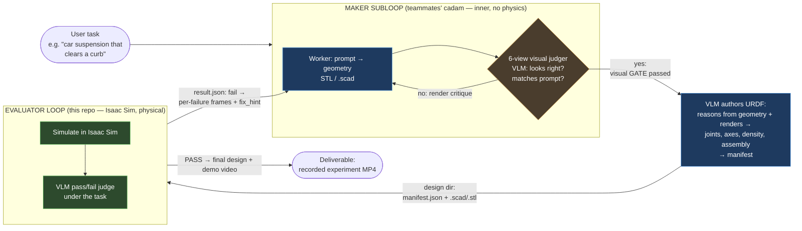
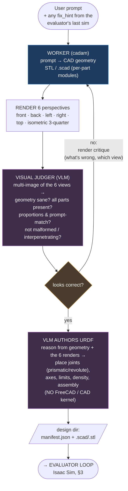
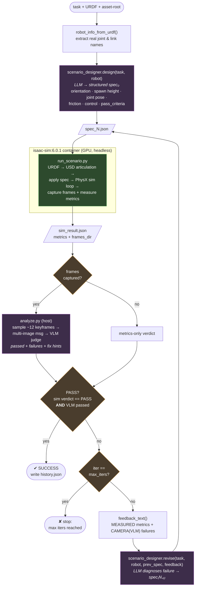
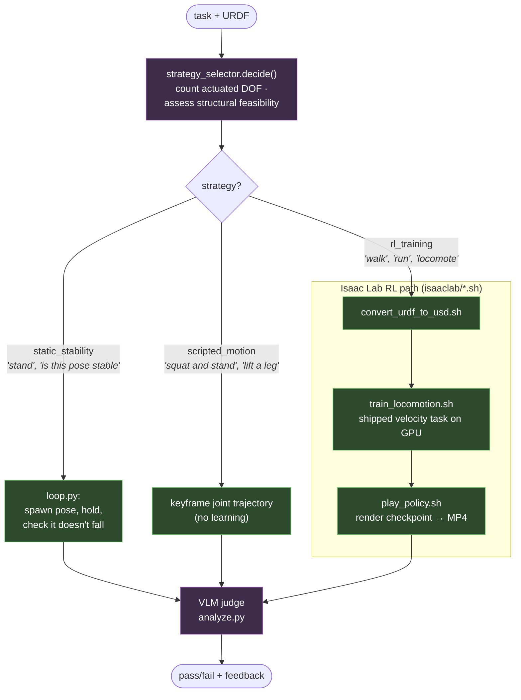
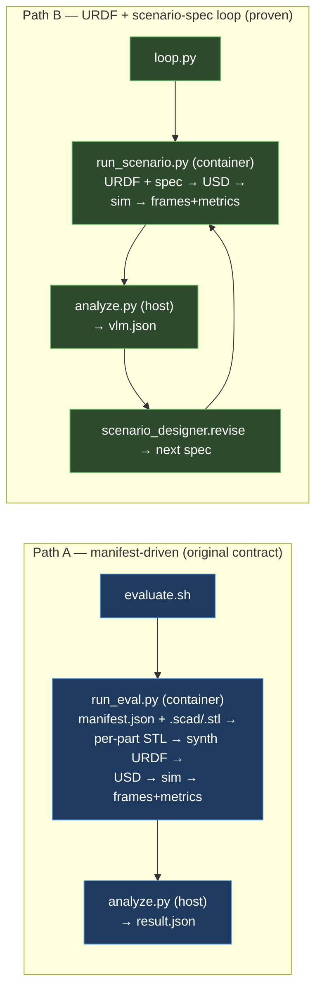

# PhysCAD — CAD + Isaac Sim Design Loop

Task-oriented CAD: instead of generating geometry that *looks* plausible, every
design is **simulated in NVIDIA Isaac Sim under the user's actual task** and judged
by a vision model. Failures come back as frames + concrete fix hints, and the
design (or its test scenario) is revised until it physically works.

> **Thesis (shown empirically):** numeric pose metrics gave a *false PASS* on the
> ANYmal stand-still run (tilt read 2.1°), while the VLM watching the frames
> correctly said *FAIL — "tips onto its side by frame 3, ends overturned."*
> The camera/VLM judge is what makes the evaluation trustworthy.

---

## 1. High-level: two nested loops

The system is **two feedback loops in series**, connected by a file contract:

- **Maker subloop (inner, fast, cheap):** a *worker* generates CAD geometry and a
  *6-perspective visual judger* (VLM) checks it on looks alone — proportions, parts
  present, matches the prompt, not malformed. Iterates here until the geometry is
  sane. No physics. Once the geometry passes, **a VLM authors the URDF directly** —
  reasoning from the geometry + its renders to place joints, axes, and densities
  (no separate CAD kernel / FreeCAD step). This is a cheap pre-filter that keeps
  junk geometry out of the expensive sim.
- **Evaluator loop (outer, slow, physical):** only a design that *passes the visual
  gate* gets simulated in Isaac Sim and judged under the actual task. Physics
  failures (`fix_hint`s) feed all the way back to the worker.



**The two gates are different questions.** The maker's visual judge asks *"does this
geometry look like a correct suspension?"* (cheap, static, 6 renders). The
evaluator's VLM asks *"does it physically survive the curb?"* (expensive, dynamic,
sim frames). Visual-plausible ≠ physically-working — which is the whole reason the
sim stage exists — but the visual gate stops obviously-broken geometry from ever
burning a ~minutes-long GPU sim.

**The contract** (`evaluator/README.md`): the maker hands over a *design dir* =
`manifest.json` + the `.scad`/`.stl` it references. The evaluator hands back
`out/result.json` = `passed`, a `summary`, and a `failures[]` list where each
failure carries the **frame indices that show it** and a **`fix_hint`** for the
generator. Key constraint: a fused mesh can't articulate — for suspension the
maker emits a `.scad` with **one module per part** (named in
`manifest.parts[].render_module`) so the evaluator can synthesize joints.

---

## 2. The maker subloop (worker + 6-perspective visual judger)

> Owned by teammates (`cadam`); shown here because it is the inner loop that feeds
> the evaluator. No physics runs here — this stage is pure geometry + vision.

The maker iterates **before** anything reaches Isaac Sim. A *worker* turns the
prompt into CAD geometry; a *visual judger* renders that geometry from **6
perspectives** and asks a VLM whether it looks right and matches the prompt. Only
when the geometry clears that gate does a VLM author the URDF (joints, axes,
densities) and emit the design dir.



**Why 6 views and not 1.** A single render hides failure modes behind the geometry
— a missing rear control arm or an interpenetrating part can be invisible head-on.
Six orthogonal-ish viewpoints (front/back/left/right/top + a 3-quarter iso) give
the VLM enough coverage to catch malformed or incomplete geometry that a single
projection would miss.

**Why the VLM authors the URDF directly (no FreeCAD).** `cadam` emits geometry
only (`.scad`/`.stl`, no joints). Rather than round-tripping through a CAD kernel,
a VLM reads the geometry *and its renders* and writes the URDF/manifest — deciding
where joints go, their axes and limits, and per-part density. This keeps the whole
maker in the "AI reasons about pictures + geometry" regime and avoids a lossy
kernel hand-off. (The per-part `.scad` modules matter here: a fused mesh can't
articulate, so the worker must keep parts separable for the URDF author to joint
them.)

**Two feedback signals reach the worker, at different cadence:**
- *fast/inner* — the visual judger's render critique (geometry looks wrong), no sim.
- *slow/outer* — the evaluator's `fix_hint` (geometry is physically wrong: bottoms
  out, parts detach), after a full Isaac Sim pass (§3).

---

## 3. The closed iteration loop (proven end-to-end)

This is the heart of the system: `evaluator/loop.py` runs on the host and drives
Isaac Sim until the design passes or hits `--max-iters`. It is **task-oriented**
— an LLM *scenario designer* invents the physics test from the task + the robot's
real joint/link names, and *revises* it from simulation feedback.



**Why two judges, ANDed.** The sim verdict is cheap numeric pass/fail
(`min_base_z`, `max_drift`, `survive_s`). The VLM verdict is what the camera
actually saw. A design only passes if **both** agree — because numbers alone
green-lit a robot that had already toppled. *(Note: the numeric metric code has a
known bug — it reads the articulation-root frame, which stays fixed, not the base
body that moves. Until fixed, the VLM verdict is the one to trust.)*

---

## 4. The strategy gate (how to evaluate at all)

Before holding a static pose, the evaluator can decide a task needs a *learned
controller*. `evaluator/strategy_selector.py` is the planning stage — given the
task + actuated-DOF count, an LLM picks one of three evaluation modes and flags
structural blockers (e.g. a robot with zero actuated joints can't be controlled).



Proven: Cassie trains a walking policy on a single A10 (~0.73 s/iter, ~12–18 min);
the VLM then reads the rendered behavior as "progressing, structurally sound" vs
collapse.

---

## 5. Two entry paths in the code

The repo carries two pipelines that share the same VLM judge and contract shape:



- **Path A** is the maker→evaluator handoff: takes a real CAD `manifest.json`,
  derives the URDF from geometry, runs a single sim + judge. This is what closes
  the loop *back to the maker* (the maker re-generates geometry from `fix_hint`s).
- **Path B** is the self-contained iteration loop proven end-to-end on ANYmal C
  and Cassie. It iterates the **test scenario** (not the geometry) against a fixed
  URDF — the inner loop that validated the whole approach while the maker was paused.

---

## 6. Where it runs

| Stage | Host | Notes |
|-------|------|-------|
| `loop.py`, `scenario_designer.py`, `strategy_selector.py`, `analyze.py` | host venv | Azure key stays out of the container; LLM/VLM calls go to Azure OpenAI |
| `run_scenario.py` / `run_eval.py` | inside `nvcr.io/nvidia/isaac-sim:6.0.1` | **entrypoint overridden** to `python.sh` (image default just launches the WebRTC streamer); run **detached** so an SSH reset can't kill it |
| RL training | Isaac Lab in `isaac-lab:6.0.1` | GPU, headless |

- **Box:** Aliyun A10 (`ecs.gn7i`, 23 GB, RT cores), Ubuntu 26.04, driver 595.71.05.
  All big artifacts under `/data/physcad`; host `/data/physcad` mounts to container `/work`.
- **VLM:** Azure OpenAI — *no native-video model*, so the evaluator samples ~12
  keyframes into a multi-image message. Live deployment is `gpt-5.4`; needs
  `max_completion_tokens` (not `max_tokens`) and rejects custom `temperature`.
- **Deliverable:** recorded experiment MP4s for the demo (the
  before/after loop videos in `physcad_videos/`).
```
