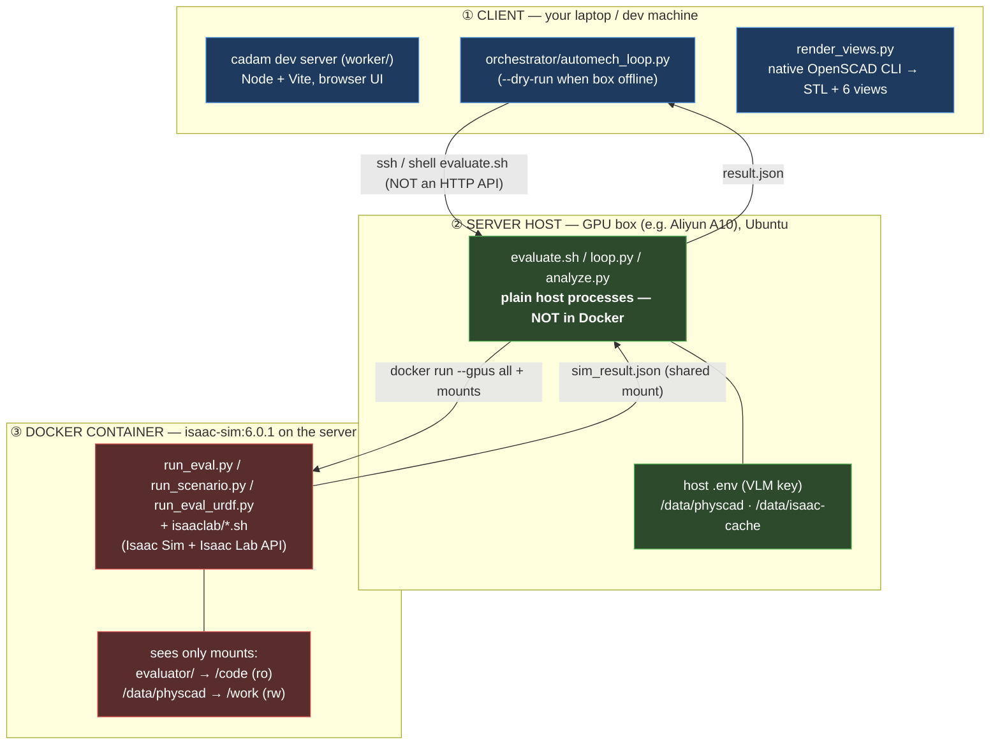

# PhysCAD Researcher / AutoMech

**Task-oriented CAD generation, closed-loop with physics.** Instead of producing
geometry that merely *looks* plausible, every design is simulated in **NVIDIA Isaac
Sim** under the user's actual task and judged by a vision model. Failures come back
as rendered frames plus concrete fix hints, and the design is revised until it
physically works.

> **Thesis (shown empirically):** numeric pose metrics gave a *false PASS* on the
> ANYmal stand-still run (tilt read 2.1°), while the VLM watching the frames
> correctly said *FAIL — "tips onto its side by frame 3, ends overturned."*
> The camera/VLM judge is what makes the evaluation trustworthy.

## Demo

https://github.com/willejiang/AutoMech/raw/main/assets/AutoMech1.mp4

<!-- Inline player (renders where raw HTML video is allowed; falls back to the link on github.com Markdown). -->
<video src="assets/AutoMech1.mp4" controls muted width="720">
  Your viewer can't embed the video —
  <a href="assets/AutoMech1.mp4">download AutoMech1.mp4</a>.
</video>

---

## What this is

Two halves connected by a file contract, run as a closed loop:

- **Maker** = [`worker/`](worker/) — **cadam**, a text→OpenSCAD web app (React + Vite
  + Supabase, OpenSCAD-WASM in the browser). Turns a prompt into a `.scad` model.
- **Evaluator** = [`evaluator/`](evaluator/) — **NVIDIA Isaac Sim + Isaac Lab**,
  running in Docker on a GPU box. Simulates the design under the task and returns a
  VLM pass/fail with per-failure frames + fix hints.
- **Orchestrator** = [`orchestrator/`](orchestrator/) — the outer automation loop
  that drives maker → render → visual gate → URDF author → evaluator → feedback.

See [`DESIGN_LOOP.md`](DESIGN_LOOP.md) and [`evaluator/ARCHITECTURE.md`](evaluator/ARCHITECTURE.md)
for the full architecture with diagrams.

> **Isaac Sim and Isaac Lab are NOT in this repo.** They are installed/cloned
> externally (see [Setup B](#setup-b--evaluator-isaac-sim--isaac-lab)). This repo
> only holds the evaluator's *scripts*, which run **inside** the Isaac Sim
> container. Links: [Isaac Sim](https://developer.nvidia.com/isaac-sim) ·
> [Isaac Lab](https://github.com/isaac-sim/IsaacLab).

---

## The three tiers (what runs where)

This is the part that trips people up: there are **three execution locations**, not
two. The client drives the server over SSH; the server runs the GPU container.



| Component | Tier | GPU? |
|-----------|------|------|
| cadam web app (`worker/`) | ① client (or any web host) | no |
| `orchestrator/*.py` (loop, gen, render, gate, author) | ① client | no |
| `evaluate.sh`, `loop.py`, `scenario_designer.py` | ② server **host** | no |
| `analyze.py` (VLM judge — holds the key) | ② server **host** | no |
| `run_eval.py` / `run_scenario.py` / `run_eval_urdf.py` | ③ Docker container | **yes** |
| `isaaclab/*.sh` (RL train/play/convert) | ③ Docker container | **yes** |

**Why the split:** the container has the GPU but must not hold the VLM API key, so
`analyze.py` runs on the host. The host↔container handoff is **a file on a shared
mount** (`sim_result.json`), not a network call. Note the path rewrite: the host's
`/data/physcad/...` is the container's `/work/...` — same bytes, two names.

---

## Repo layout

| Path | What |
|------|------|
| [`worker/`](worker/) | **Maker** — cadam text→OpenSCAD web app (Node/Vite/Supabase). |
| [`evaluator/`](evaluator/) | **Evaluator** — Isaac Sim runners + `isaaclab/` scripts + the VLM judge. |
| [`orchestrator/`](orchestrator/) | **Loop** — ties maker → evaluator into one automation loop. |
| [`DESIGN_LOOP.md`](DESIGN_LOOP.md) | Architecture of the two nested loops (diagrams). |
| [`evaluator/ARCHITECTURE.md`](evaluator/ARCHITECTURE.md) | Evaluator file call-graph + the two entry paths. |
| [`orchestrator/README.md`](orchestrator/README.md) | How the outer loop is wired + run. |
| `assets/AutoMech1.mp4` | Demo recording. |

> ⚠️ **Not in this repo (installed externally):** Isaac Sim (the
> `nvcr.io/nvidia/isaac-sim:6.0.1` Docker image) and Isaac Lab (cloned from GitHub).
> The repo carries only the *scripts* that run inside that container.

---

## Prerequisites

**Client side (laptop / dev machine):**
- **Node.js** `^20.19.0 || >=22.12.0`, **npm** `>=10` — for cadam (`worker/`).
- **OpenSCAD** (native CLI) + the BOSL2/MCAD libraries — for headless `.scad`
  rendering in the orchestrator. [openscad.org](https://openscad.org/).
- **Python 3** with `openai` — for `orchestrator/` and host-side VLM calls.

**Server side (GPU box):**
- An **NVIDIA GPU** with RT cores (A10 proven) + driver **≥ 595.58.03** (Isaac Sim
  6.0.1 requirement).
- **Docker** + **NVIDIA Container Toolkit** (`--runtime=nvidia --gpus all`).
- Host dirs: **`/data/physcad`** (artifacts, mounts to `/work`) and
  **`/data/isaac-cache`** (shader cache, persists between runs).
- **Python 3** with `openai` on the host — `analyze.py` runs here.

> **China-network note:** `nvcr.io` (NGC) works for pulling Isaac Sim; Docker Hub
> and `nvidia.github.io` are blocked. Use USTC/Tsinghua mirrors for apt + the
> NVIDIA Container Toolkit `.debs`, and the Tsinghua pip index for Isaac Lab
> (`install_isaaclab.sh` already sets `PIP_INDEX_URL`).

---

## Setup A — Maker (cadam)

cadam is a real **SSR web app** (TanStack Start + Nitro), not a static export, and
it has a **hard Supabase dependency** — auth, the conversation DB, and image/mesh
storage are hit on every generation request. There is no built-in headless/CLI mode.

```bash
cd worker
npm install
# build the client + server bundles (→ worker/dist/)
npm run build
# dev server on http://localhost:3000  (preview build: npm run preview → :4173)
npm run dev
```

**Required environment** (create `worker/.env` — no `.env.example` ships):

| Variable | Purpose | Required |
|----------|---------|----------|
| `VITE_SUPABASE_URL` | Supabase project URL | ✅ |
| `VITE_SUPABASE_ANON_KEY` | Supabase anon key (client auth) | ✅ |
| `SUPABASE_SERVICE_ROLE_KEY` | Supabase service role (server) | ✅ |
| `LLM_GATEWAY_URL` | LLM proxy (default `http://localhost:8313`) | ✅ |
| `ANTHROPIC_API_KEY` | Claude models (via gateway) | ✅ |
| `OPENROUTER_API_KEY` | GPT/Gemini routing (via gateway) | ✅ |
| `BILLING_SERVICE_URL` / `BILLING_SERVICE_KEY` | token-usage tracking | ✅ |
| `OPENAI_API_KEY` / `GOOGLE_API_KEY` / `FAL_KEY` | image/mesh generation | optional |
| `VITE_POSTHOG_PROJECT_KEY` / `VITE_POSTHOG_HOST` | analytics | optional |

You'll need a Supabase project with the schema in [`worker/supabase/`](worker/supabase/)
applied. Without Supabase, cadam will not authenticate or persist a conversation, so
generation won't run.

> **Driving cadam headlessly (in the loop):** the orchestrator does **not** boot
> this web app. It replicates cadam's generation by calling the LLM directly with
> cadam's own prompt (`WORKER_MODE=direct`), then renders the `.scad` with the
> native OpenSCAD CLI. So for the automation loop you do **not** need Supabase — see
> [`orchestrator/README.md`](orchestrator/README.md). The full web app above is for
> interactive use / the demo.

---

## Setup B — Evaluator (Isaac Sim + Isaac Lab)

Done **on the GPU server**. Neither Isaac Sim nor Isaac Lab lives in this repo.

### 8a. Pull Isaac Sim 6.0.1 (Docker image, from NGC)

```bash
docker pull nvcr.io/nvidia/isaac-sim:6.0.1   # anonymous pull works; ~20 GB
```
[Isaac Sim](https://developer.nvidia.com/isaac-sim) ·
[NGC catalog](https://catalog.ngc.nvidia.com/orgs/nvidia/containers/isaac-sim).
Verify GPU-in-container: `docker run --rm --gpus all nvcr.io/nvidia/isaac-sim:6.0.1 nvidia-smi`.

### 8b. Install Isaac Lab into the container → commit `isaac-lab:6.0.1`

Isaac Lab is **cloned, not vendored**. Put it in the host dir that mounts to
`/work` so it appears at `/work/IsaacLab` inside the container:

```bash
# on the host
cd /data/physcad
git clone https://github.com/isaac-sim/IsaacLab.git

# start the container with the GPU + mounts, OVERRIDING the entrypoint
# (the default entrypoint launches the WebRTC streamer and swallows your command)
docker run -it --gpus all --runtime=nvidia \
  --entrypoint /bin/bash \
  -v /data/physcad:/work \
  nvcr.io/nvidia/isaac-sim:6.0.1

# inside the container: run the project's installer (does ./isaaclab.sh --install rl,
# Tsinghua pip mirror, sanity-imports isaaclab + rsl_rl)
bash /work/<repo>/evaluator/isaaclab/install_isaaclab.sh

# from ANOTHER host shell, snapshot the container as a reusable image:
docker commit <container_id> isaac-lab:6.0.1
```

[Isaac Lab repo](https://github.com/isaac-sim/IsaacLab) ·
[Isaac Lab docs](https://isaac-sim.github.io/IsaacLab/).

> **Version pairing caveat:** Isaac Sim and Isaac Lab versions are tightly coupled.
> This repo targets **Isaac Sim 6.0.1** (what ran on ANYmal/Cassie). The official
> Isaac Lab docs currently recommend Isaac Sim 5.1.0 for the main line and list a
> `3.0.0-beta2` release; if you pick a different Isaac Lab version, confirm its
> Isaac Sim pairing in the
> [installation guide](https://isaac-sim.github.io/IsaacLab/main/source/setup/installation/index.html)
> first, and update the image tag in `evaluator/evaluate.sh` + `evaluator/loop.py`
> to match.

### 8c. Host config

```bash
mkdir -p /data/physcad /data/isaac-cache
cp evaluator/.env.example evaluator/.env   # then fill in the VLM endpoint + key
```
`evaluator/.env` drives `analyze.py` / `scenario_designer.py`. It supports either a
local Copilot proxy (`http://localhost:8313/v1`, `claude-opus-4.8`) or Azure OpenAI
— see the comments in [`evaluator/.env.example`](evaluator/.env.example).

---

## Running it

**(a) Evaluator on a single design dir** (manifest + `.scad`/`.stl`):
```bash
# on the server host
cd evaluator
./evaluate.sh /data/physcad/<design_dir>     # → <design_dir>/out/result.json
```

**(b) The iterating scenario-spec loop** (URDF + task, revises until PASS):
```bash
python3 loop.py --urdf .../robot.urdf --asset-root ... \
   --task "make sure it can stand still" --workdir /data/physcad/loop_x --max-iters 4
```

**(c) The full automation loop** (maker → evaluator), from the client:
```bash
cd orchestrator
cp .env.example .env                         # then fill in the VLM endpoint + key
python automech_loop.py --task "quarter-car suspension that clears a 10cm curb" \
   --dry-run --max-iters 3
```
Drop `--dry-run` once the GPU box is up.

> ⚠️ **`--dry-run` is NOT zero-setup.** It stubs **only** the Isaac Sim step (so you
> don't need the GPU box / Docker). The stages *before* it still run for real and
> have hard prerequisites:
> - **`orchestrator/.env` with a working VLM endpoint + key** — cadam generation, the
>   visual gate, and the URDF author all make live LLM/VLM calls. Without it the very
>   first step fails with `KeyError: 'AZURE_OPENAI_ENDPOINT'`.
> - **The native OpenSCAD CLI on PATH** (`OPENSCAD_BIN` or `openscad`) — the render
>   stage compiles the `.scad` to STL + the 6 views; with no OpenSCAD it can't produce
>   views and the gate fails closed.
>
> So `--dry-run` exercises *generate → render → visual gate → author → (stubbed) sim →
> feedback* — everything except the GPU physics. To check pieces in isolation without
> the full loop, the **"Test individual stages"** section of
> [`orchestrator/README.md`](orchestrator/README.md) runs render / gate / generation
> on their own; a built-in fully-offline mock of the whole loop is not yet wired.

> **Two container gotchas** (both already handled in the scripts): the isaac-sim
> image's default entrypoint launches the WebRTC streamer and **swallows your
> script** — you must override it (`--entrypoint /isaac-sim/python.sh`). And run the
> sim container **detached** (`-d`); an SSH "Connection reset" kills an attached
> container mid-run.

---

## Links

- **Isaac Sim** — https://developer.nvidia.com/isaac-sim
- **Isaac Lab** (repo) — https://github.com/isaac-sim/IsaacLab
- **Isaac Lab** (docs / install) — https://isaac-sim.github.io/IsaacLab/
- **OpenSCAD** — https://openscad.org/
- Internal: [`DESIGN_LOOP.md`](DESIGN_LOOP.md) ·
  [`evaluator/ARCHITECTURE.md`](evaluator/ARCHITECTURE.md) ·
  [`orchestrator/README.md`](orchestrator/README.md)
