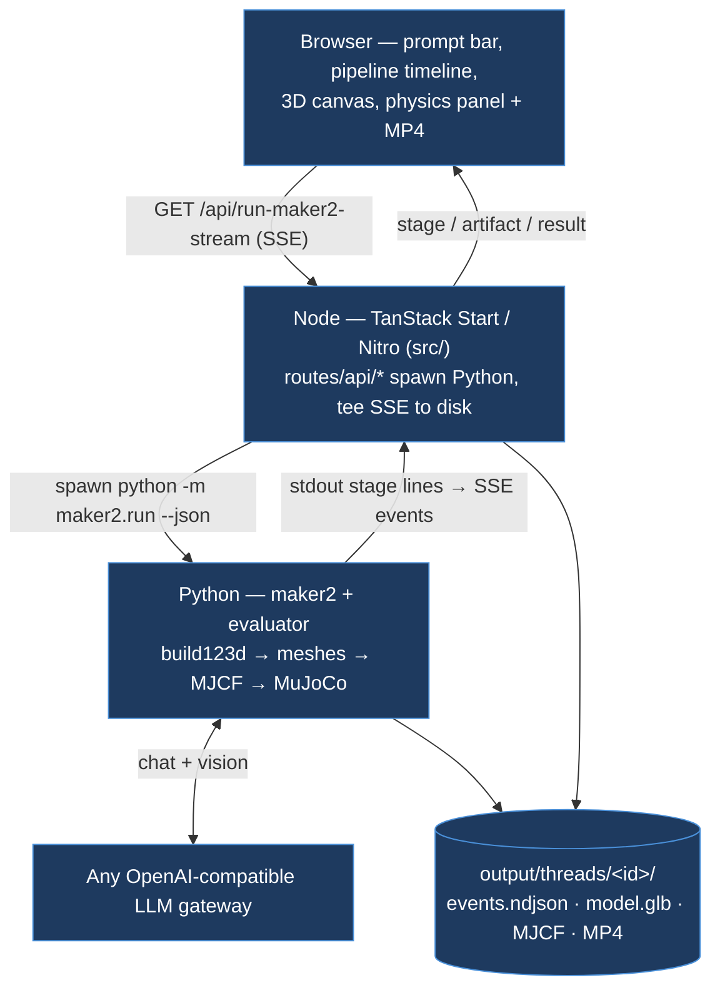
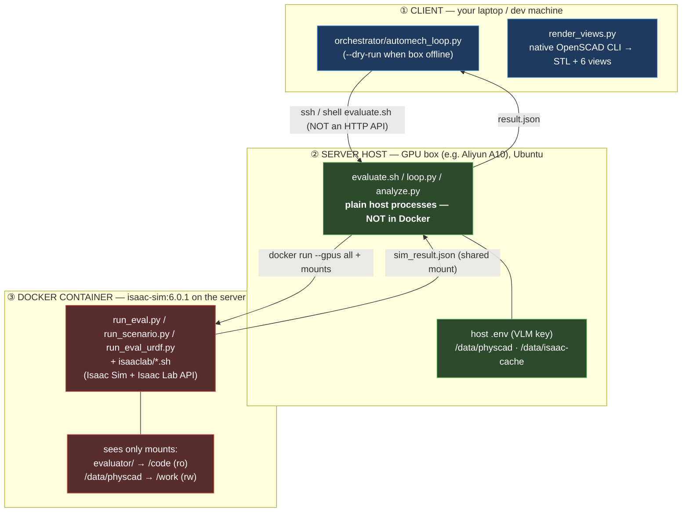

# PhysCAD Researcher / AutoMech

> 🎉🏆 **Our AutoMech project won 2nd place in the Hardware AI Innovation track at the Microsoft Global Intern Hackathon 2026!** 🎉🥈

**Task-oriented CAD generation, closed-loop with physics.** Instead of producing
geometry that merely *looks* plausible, every design is **simulated under the user's
actual task** and judged on what it did. Failures come back as metrics, frames, and
concrete fix hints, and the design is revised until it physically works.

> **Thesis (shown empirically):** numeric pose metrics gave a *false PASS* on the
> ANYmal stand-still run (tilt read 2.1°), while the VLM watching the frames
> correctly said *FAIL — "tips onto its side by frame 3, ends overturned."*
> A design is only as good as the judge, and the judge has to watch the machine work.


## Demo

https://github.com/willejiang/AutoMech/raw/main/assets/AutoMech1.mp4

<!-- Inline player (renders where raw HTML video is allowed; falls back to the link on github.com Markdown). -->
<video src="assets/AutoMech1.mp4" controls muted width="720">
  Your viewer can't embed the video —
  <a href="assets/AutoMech1.mp4">download AutoMech1.mp4</a>.
</video>

---

## What this is

**One app, one command.** `npm run dev` serves the AutoMech web UI, which spawns the
Python pipeline directly and streams its stages back over SSE. Everything runs on
your machine, on the **CPU** — no GPU, no Docker, no database.

- **Maker** = [`maker2/`](maker2/) — the CAD pipeline. An agent authors the machine as
  a **build123d** script, exports per-part meshes, and a VLM judges six rendered views.
- **Evaluator** = [`evaluator/`](evaluator/) — the physics half. MuJoCo drives the
  machine under the task and reports whether it *did the job*, not whether it looks
  right. Failures come back as metrics + video and drive the next iteration.
- **UI** = [`src/`](src/) — React 19 + TanStack Start. Prompt bar, live pipeline
  timeline, orbitable 3D model, physics panel with the recorded MP4, and past runs.

```bash
npm install && npm run dev      # → http://localhost:3000
```

There is a **second, older path** in this repo — `orchestrator/` driving Isaac Sim on a
GPU box. It is what the hackathon demo above ran, and it still works, but it is no
longer the main line. It is documented in
[Appendix: the Isaac Sim path](#appendix--the-isaac-sim-path-original-loop).

See [`maker2/PIPELINE.md`](maker2/PIPELINE.md) for the pipeline internals and
[`DESIGN_LOOP.md`](DESIGN_LOOP.md) for the loop's architecture.

---

## The pipeline

The default path is **single-agent**: one agent authors the *whole* machine as one
build123d script. Earlier versions split the machine across a boss and per-subassembly
managers, and each seam between agents was a place for the assembly to go wrong; one
agent holding the whole model has no seams to get wrong.

```
agent (LLM)        prompt → ONE build123d script: every part, its pose, and how the
  │                parts join. Optionally grounded by the local KB and web search.
  ▼
build             the script runs → per-part meshes + a rigid-conflict self-check
  │               (interference vs. clearance fits, unsupported parts, overlaps).
  │               Conflicts go back to the agent with coordinates, not adjectives.
  ▼
judge (VLM)       six offscreen views; FAIL feeds concrete fixes into the next pass.
  ▼
MJCF assembled    every part a flat body in world coordinates; joints become MuJoCo
  │               joints, static structure becomes equality welds, collision geometry
  │               is signed-distance (SDF) off the original mesh.
  ▼
physics (MuJoCo)  strategy_selector picks the test; scenario_designer writes free
                  setup(m,d) / control(m,d,t) Python; the run measures whether the
                  machine DID THE JOB. Records an MP4 per test.
```

**Why physics, and not just a prettier render.** A gearbox that renders perfectly can
still be a solid brick. The test drives the input and measures the output — parts that
must turn, turn; parts that must stay put, stay put. The judge that matters is the one
watching what the machine *does*.

**Key files:**

| Path | What |
|------|------|
| [`maker2/run.py`](maker2/run.py) | Driver + refine loop; writes `result.json`, `run.json`, per-thread `thread.json`. |
| [`maker2/single_agent.py`](maker2/single_agent.py) · [`maker2/prompts/`](maker2/prompts/) | The default path: one agent → one build123d script → self-check → refine. |
| [`maker2/mjcf_builder.py`](maker2/mjcf_builder.py) | Parts → MJCF: flat world-space bodies, real mesh inertia, SDF collision, press-fit vs. clearance fits. |
| [`maker2/physics.py`](maker2/physics.py) | `strategy_selector` → `scenario_designer` → MuJoCo run; encodes a per-test MP4. Support test runs in parallel. |
| [`maker2/support_test.py`](maker2/support_test.py) | Is every part actually held up by something, or is it floating? |
| [`maker2/kb/`](maker2/kb/) | Retrieval corpus (fits, materials, what passive parts ride on) injected into the agent's prompt. |
| [`maker2/config.py`](maker2/config.py) | All settings; resolution order is defaults < JSON file < env vars < CLI. |
| [`evaluator/run_scenario_mujoco.py`](evaluator/run_scenario_mujoco.py) | Runs the scenario, including the designer's own `setup`/`control` functions. |

### Hierarchical (boss → managers → assembler)

Still available with `--hierarchy`, for machines big enough that one script gets
unwieldy. A **boss** splits the machine into subassemblies and authors a graph of typed
seams (**topology, never placement coordinates**); one **manager** builds each
subassembly in isolation; a deterministic **assembler** solves the placement — gear
meshes land at the true center distance read off the built gears (`module × teeth`),
so they engage by construction rather than by an LLM guessing coordinates.

```bash
python -m maker2.run "a two-stage gear reducer" --hierarchy --kb --deep-think --json
```

See **[`maker2/PIPELINE.md`](maker2/PIPELINE.md)** for every agent's I/O, the
deterministic gates between them, and how a rejection routes back (rebuild one
subassembly vs. re-plan the whole machine).

---

## What runs where

One machine, three processes. The browser talks to the app; the app spawns Python.


```mermaid
flowchart TB
    B["Browser — prompt bar, pipeline timeline,<br/>3D canvas, physics panel + MP4"]
    A["Node — TanStack Start / Nitro (src/)<br/>routes/api/* spawn Python, tee SSE to disk"]
    P["Python — maker2 + evaluator<br/>build123d → meshes → MJCF → MuJoCo"]
    G["Any OpenAI-compatible LLM gateway"]
    D[("output/threads/&lt;id&gt;/<br/>events.ndjson · model.glb · MJCF · MP4")]

    B -->|"GET /api/run-maker2-stream (SSE)"| A
    A -->|"spawn python -m maker2.run --json"| P
    P -->|"stdout stage lines → SSE events"| A
    A -->|"stage / artifact / result"| B
    P <-->|"chat + vision"| G
    P --> D
    A --> D

    classDef c fill:#1e3a5f,stroke:#4a90d9,color:#fff
    class B,A,P,G,D c
```

| Component | Where | GPU? |
|-----------|-------|------|
| `src/` — UI + API routes | your machine, Node | no |
| `maker2/` — CAD agents, MJCF build | your machine, Python | no |
| `evaluator/run_scenario_mujoco.py` — physics | your machine, Python | no |
| LLM gateway | wherever you point it | — |

The Node↔Python handoff is **a subprocess and its stdout**, not a network call: the
API route spawns `python -m maker2.run`, turns each stage line into an SSE event, and
tees the stream to `output/threads/<id>/events.ndjson` so reopening a run replays it.
Nothing needs a database.

---

## Repo layout

| Path | What |
|------|------|
| [`src/`](src/) | **The app** — React 19 + TanStack Start UI and the API routes that spawn the pipeline. |
| [`maker2/`](maker2/) | **Maker** — the CAD pipeline: agents, build123d geometry, MJCF assembly, gates, and the retrieval KB. |
| [`evaluator/`](evaluator/) | **Evaluator** — the MuJoCo/PyBullet scenario runners, `strategy_selector`/`scenario_designer`, and the VLM judge. |
| [`maker2/PIPELINE.md`](maker2/PIPELINE.md) | Pipeline internals: agent I/O and the deterministic gates between them. |
| [`docs/`](docs/) | Findings and plans — notably [`CONTACT_PHYSICS_FINDINGS.md`](docs/CONTACT_PHYSICS_FINDINGS.md) (what MuJoCo contact actually does at assembly scale). |
| [`orchestrator/`](orchestrator/) | The older Isaac Sim loop — see the appendix. |
| `assets/AutoMech1.mp4` | Demo recording. |

---

## Setup

**Prerequisites**

- **Node.js** `^20.19.0 || >=22.12.0`, **npm** `>=10`.
- **Python 3.10+**.
- An **OpenAI-compatible LLM gateway** — either your own key or a local proxy.

**Install and run**

```bash
npm install
python -m pip install -r maker2/requirements.txt
python -m pip install -r evaluator/requirements.txt   # mujoco, trimesh, imageio-ffmpeg, ...

npm run dev        # → http://localhost:3000
```

**Point it at a model.** Open **Settings** in the sidebar and fill in the gateway URL,
model, and API key; "Save & test" makes a real call and tells you whether the gateway
answers. The key is stored server-side in `.automech/llm.json` (mode `0600`,
gitignored) and never goes in the browser.

Equivalently, by environment — these win over the settings file:

| Variable | Purpose | Default |
|----------|---------|---------|
| `FREECAD_AI_BASE_URL` | gateway base URL; the `/v1` suffix is required | `http://127.0.0.1:8313/v1` |
| `FREECAD_AI_API_KEY` | key for that gateway | — |
| `FREECAD_AI_MODEL` | model id | `claude-opus-4.8` |
| `PYTHON_BIN` | interpreter the app spawns | `python3` |

Full resolution order is **defaults < `.automech/llm.json` < environment < CLI flags**
([`maker2/config.py`](maker2/config.py)).

**Or skip the UI** and run the pipeline straight from the terminal:

```bash
python -m maker2.run "a hand-cranked gear reducer" --json --physics
python -m maker2.run "a two-stage gear reducer" --hierarchy --kb --deep-think --json
```

**Tests** are executable golden scripts, not a pytest suite — run one directly:

```bash
python -m maker2.tests.golden_two_gears
npm run typecheck
```

---

## Appendix — the Isaac Sim path (original loop)

The loop that won the hackathon, kept because it still runs and because its thesis —
*trust the camera, not the pose numbers* — is what the current physics test inherited.
It is heavier: a GPU box, Docker, and Isaac Sim, none of which the main path needs.

`orchestrator/` drives: generate → render → six-view visual gate → author a manifest →
simulate in Isaac Sim → feed failures back. Three execution locations, not two — the
client drives the server over SSH, and the server runs the GPU container.


```mermaid
flowchart TB
    subgraph CLIENT["① CLIENT — your laptop / dev machine"]
        direction TB
        C2["orchestrator/automech_loop.py<br/>(--dry-run when box offline)"]
        C3["render_views.py<br/>native OpenSCAD CLI → STL + 6 views"]
    end

    subgraph SERVER["② SERVER HOST — GPU box (e.g. Aliyun A10), Ubuntu"]
        direction TB
        S1["evaluate.sh / loop.py / analyze.py<br/><b>plain host processes — NOT in Docker</b>"]
        S2["host .env (VLM key)<br/>/data/physcad · /data/isaac-cache"]
        S1 --- S2
    end

    subgraph DOCKER["③ DOCKER CONTAINER — isaac-sim:6.0.1 on the server (GPU)"]
        direction TB
        D1["run_eval.py / run_scenario.py / run_eval_urdf.py<br/>+ isaaclab/*.sh<br/>(Isaac Sim + Isaac Lab API)"]
        D2["sees only mounts:<br/>evaluator/ → /code (ro)<br/>/data/physcad → /work (rw)"]
        D1 --- D2
    end

    C2 -->|"ssh / shell evaluate.sh (NOT an HTTP API)"| S1
    S1 -->|"docker run --gpus all + mounts"| D1
    D1 -->|"sim_result.json (shared mount)"| S1
    S1 -->|"result.json"| C2

    classDef client fill:#1e3a5f,stroke:#4a90d9,color:#fff
    classDef server fill:#2d4a2d,stroke:#5cb85c,color:#fff
    classDef docker fill:#5a2d2d,stroke:#d9534f,color:#fff
    class C2,C3 client
    class S1,S2 server
    class D1,D2 docker
```

**Why the split:** the container has the GPU but must not hold the VLM API key, so
`analyze.py` runs on the host. The host↔container handoff is **a file on a shared
mount** (`sim_result.json`), not a network call. Note the path rewrite: the host's
`/data/physcad/...` is the container's `/work/...` — same bytes, two names.

> ⚠️ **Not in this repo (installed externally):** Isaac Sim (the
> `nvcr.io/nvidia/isaac-sim:6.0.1` Docker image) and Isaac Lab (cloned from GitHub).
> The repo carries only the *scripts* that run inside that container.
> [Isaac Sim](https://developer.nvidia.com/isaac-sim) ·
> [Isaac Lab](https://github.com/isaac-sim/IsaacLab).

Architecture in detail: [`DESIGN_LOOP.md`](DESIGN_LOOP.md) ·
[`evaluator/ARCHITECTURE.md`](evaluator/ARCHITECTURE.md) ·
[`orchestrator/README.md`](orchestrator/README.md).

### Prerequisites

**Client:** Node **≥20.19**, **OpenSCAD** native CLI + BOSL2/MCAD
([openscad.org](https://openscad.org/)), Python 3 with `openai`.

**GPU box:** an **NVIDIA GPU** with RT cores (A10 proven) + driver **≥ 595.58.03**;
**Docker** + **NVIDIA Container Toolkit**; host dirs **`/data/physcad`** (mounts to
`/work`) and **`/data/isaac-cache`**; Python 3 with `openai` on the host.

> **China-network note:** `nvcr.io` (NGC) works for pulling Isaac Sim; Docker Hub
> and `nvidia.github.io` are blocked. Use USTC/Tsinghua mirrors for apt + the
> NVIDIA Container Toolkit `.debs`, and the Tsinghua pip index for Isaac Lab
> (`install_isaaclab.sh` already sets `PIP_INDEX_URL`).

### Setup — Isaac Sim + Isaac Lab

Done **on the GPU server**. Neither Isaac Sim nor Isaac Lab lives in this repo.

#### 1. Pull Isaac Sim 6.0.1 (Docker image, from NGC)

```bash
docker pull nvcr.io/nvidia/isaac-sim:6.0.1   # anonymous pull works; ~20 GB
```
[Isaac Sim](https://developer.nvidia.com/isaac-sim) ·
[NGC catalog](https://catalog.ngc.nvidia.com/orgs/nvidia/containers/isaac-sim).
Verify GPU-in-container: `docker run --rm --gpus all nvcr.io/nvidia/isaac-sim:6.0.1 nvidia-smi`.

#### 2. Install Isaac Lab into the container → commit `isaac-lab:6.0.1`

Isaac Lab is **cloned, not vendored**. Put it in the host dir that mounts to
`/work` so it appears at `/work/IsaacLab` inside the container:

```bash
# on the host
cd /data/physcad
git clone https://github.com/isaac-sim/IsaacLab.git

# start the container with the GPU + mounts, OVERRIDING the entrypoint, as ROOT
# (base image runs as uid 1234; root is needed for pip installs + writable mounts).
# Disable OmniHub — it deadlocks in a reconnect loop and freezes training.
docker run -it --gpus all --runtime=nvidia --user root \
  --entrypoint /bin/bash -e OMNI_HUB_DISABLE=1 \
  -v /data/physcad:/work \
  nvcr.io/nvidia/isaac-sim:6.0.1

# inside the container: run the project's installer (does ./isaaclab.sh --install rl,
# Tsinghua pip mirror, sanity-imports isaaclab + rsl_rl). The restructured source
# also needs the isaaclab_physx + isaaclab_contrib extensions installed:
bash /work/<repo>/evaluator/isaaclab/install_isaaclab.sh
/isaac-sim/python.sh -m pip install -e source/isaaclab_physx -e source/isaaclab_contrib

# from ANOTHER host shell, snapshot the container as a reusable image:
docker commit <container_id> isaac-lab:6.0.1
```

[Isaac Lab repo](https://github.com/isaac-sim/IsaacLab) ·
[Isaac Lab docs](https://isaac-sim.github.io/IsaacLab/).

> **Version pairing caveat:** Isaac Sim and Isaac Lab versions are tightly coupled.
> This repo targets **Isaac Sim 6.0.1** paired with **Isaac Lab 3.0.0-beta2** (what ran on
> ANYmal/Cassie + the dog). A fresh `pip install -e` may pull a newer Isaac Lab whose
> API moved (`RigidBodyMaterialCfg` → `isaaclab_physx`), so pin the 3.0.x source and
> install `isaaclab_physx` + `isaaclab_contrib` as above. If you pick a different
> version, confirm its Isaac Sim pairing in the
> [installation guide](https://isaac-sim.github.io/IsaacLab/main/source/setup/installation/index.html)
> first, and update the image tag in `evaluator/evaluate.sh` + `evaluator/loop.py`
> to match.

#### 3. Host config

```bash
mkdir -p /data/physcad /data/isaac-cache
cp evaluator/.env.example evaluator/.env   # then fill in the VLM endpoint + key
```
`evaluator/.env` drives `analyze.py` / `scenario_designer.py`. It points at any
OpenAI-compatible LLM gateway; pick the VLM via `AZURE_VLM_DEPLOYMENT` using
`provider/model` ids (`anthropic/claude-opus-4.8`, `openai/gpt-5.4`,
`google/gemini-3.1-pro-preview`), or use Azure OpenAI directly — see the comments in
[`evaluator/.env.example`](evaluator/.env.example).

### Running the Isaac path

**(a) Evaluator on a single design dir** (manifest + `.scad`/`.stl`):
```bash
# on the server host
cd evaluator
./evaluate.sh /data/physcad/<design_dir>     # → <design_dir>/out/result.json
```

**(b) The iterating scenario-spec loop** (URDF + task, revises until PASS):
```bash
python3 loop.py --urdf .../robot.urdf --asset-root ... \
   --task "make sure it can stand still" --workdir /data/physcad/loop_x --max-iters 4
```

**(c) The full automation loop** (maker → evaluator), from the client:
```bash
cd orchestrator
cp .env.example .env                         # then fill in the VLM endpoint + key
python automech_loop.py --task "quarter-car suspension that clears a 10cm curb" \
   --dry-run --max-iters 3
```
Drop `--dry-run` once the GPU box is up.

> ⚠️ **`--dry-run` is NOT zero-setup.** It stubs **only** the Isaac Sim step (so you
> don't need the GPU box / Docker). The stages *before* it still run for real and
> have hard prerequisites:
> - **`orchestrator/.env` with a working VLM endpoint + key** — generation, the
>   visual gate, and the URDF author all make live LLM/VLM calls. Without it the very
>   first step fails with `KeyError: 'AZURE_OPENAI_ENDPOINT'`.
> - **The native OpenSCAD CLI on PATH** (`OPENSCAD_BIN` or `openscad`) — the render
>   stage compiles the `.scad` to STL + the 6 views; with no OpenSCAD it can't produce
>   views and the gate fails closed.
>
> So `--dry-run` exercises *generate → render → visual gate → author → (stubbed) sim →
> feedback* — everything except the GPU physics. To check pieces in isolation without
> the full loop, the **"Test individual stages"** section of
> [`orchestrator/README.md`](orchestrator/README.md) runs render / gate / generation
> on their own; a built-in fully-offline mock of the whole loop is not yet wired.

> **Three container gotchas** (handled in the scripts): the isaac-sim image's
> default entrypoint launches the WebRTC streamer and **swallows your script** —
> override it (`--entrypoint /isaac-sim/python.sh`). Run the sim container
> **detached** (`-d`); an SSH "Connection reset" kills an attached container
> mid-run. And **disable OmniHub** (`-e OMNI_HUB_DISABLE=1`) — if its cache service
> fails to launch it spins in a reconnect loop and **freezes training before the
> GPU engages** (no checkpoints, GPU stuck idle).

---

## Links

- **build123d** — https://build123d.readthedocs.io/
- **MuJoCo** — https://mujoco.readthedocs.io/
- **Isaac Sim** — https://developer.nvidia.com/isaac-sim
- **Isaac Lab** (repo) — https://github.com/isaac-sim/IsaacLab
- **Isaac Lab** (docs / install) — https://isaac-sim.github.io/IsaacLab/
- **OpenSCAD** — https://openscad.org/
- Internal: [`DESIGN_LOOP.md`](DESIGN_LOOP.md) ·
  [`evaluator/ARCHITECTURE.md`](evaluator/ARCHITECTURE.md) ·
  [`orchestrator/README.md`](orchestrator/README.md)
