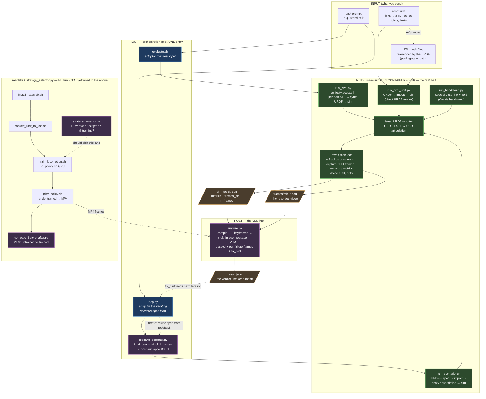

# Evaluator Architecture

What happens inside `evaluator/` when a design — a **URDF + its STL meshes**, or a
**manifest + `.scad`/`.stl`** — is sent in to be judged. Companion to the
project-wide [`../DESIGN_LOOP.md`](../DESIGN_LOOP.md); this file zooms into the
evaluator's own files and how they call each other.

## The one idea: two halves split by a file

The evaluator never runs as a single process. It is **two halves** that
communicate through one file (`sim_result.json`):

- **SIM half** — runs *inside* the `isaac-sim:6.0.1` container (needs the GPU + the
  Isaac Python API). Imports the URDF, steps PhysX, records frames, measures
  metrics. Writes `sim_result.json`.
- **VLM half** ([`analyze.py`](analyze.py)) — runs *on the host* (keeps the Azure
  key out of the container image). Reads the frames + metrics, asks a vision model
  for the pass/fail verdict. Writes `result.json`.

> **Why split:** the container has the GPU but should not hold the API key; the
> host has the key but not Isaac. The boundary is deliberately just a JSON file +
> a folder of PNGs.

## File call-graph (URDF + STL input)

## The two real entry paths

There isn't one evaluator — there are **two orchestrators**, chosen by how the
input arrives. Both share the same SIM-half mechanics and the same VLM judge
([`analyze.py`](analyze.py)).

| | **`evaluate.sh`** (manifest path) | **`loop.py`** (scenario-spec path) |
|---|---|---|
| Input | a *design dir* = `manifest.json` + `.scad`/`.stl` | a ready **URDF** + `--asset-root` + a task |
| In-container runner | [`run_eval.py`](run_eval.py): renders per-part STL, **synthesizes** the URDF from the manifest, then sims | [`run_scenario.py`](run_scenario.py): imports the URDF directly |
| Test setup | from the manifest's `scenario` block | invented by [`scenario_designer.py`](scenario_designer.py) (LLM turns the task + joint names into pose/friction/pass-criteria) |
| Iterates? | no — single pass | **yes** — `analyze.py`'s `fix_hint` → `scenario_designer.revise()` → new spec → re-sim, until PASS or max iters |
| VLM verdict | [`analyze.py`](analyze.py) | [`analyze.py`](analyze.py) (same file) |

**For a URDF + STL specifically:** that's the `loop.py` → `run_scenario.py` path, or
the minimal [`run_eval_urdf.py`](run_eval_urdf.py) runner (the one proven on
ANYmal). The URDF references the STL meshes; the runner hands it to Isaac's
`URDFImporter`, which bakes URDF + STL into a **USD articulation**, then the PhysX
loop steps it while a Replicator camera records frames and code measures base
height / tilt / drift.

## Three things worth flagging

1. **The verdict is dual, and the VLM wins.** Every runner writes a numeric
   `passed_metric` (z/tilt/drift thresholds), but `analyze.py`'s VLM verdict is
   authoritative — the numbers gave a *false PASS* on the ANYmal toppling. The fix
   is visible in `run_eval_urdf.py` (`base_body`): it binds a `RigidPrim` to the
   *base link* for a trustworthy pose, and records `pose_source` so you can tell
   whether it used the good path or fell back to the unreliable articulation-root
   frame.

2. **`run_handstand.py` is a special-case runner**, not part of the general flow —
   a hard-coded Cassie handstand pose (parity port of a teammate's PyBullet test).
   Treat it as a one-off experiment, not a reusable building block.

3. **The RL lane is NOT wired to the rest yet.** `strategy_selector.py` +
   `isaaclab/*.sh` + `compare_before_after.py` have **zero callers** — they're run
   by hand. `strategy_selector.py` is *meant* to be the front-door router
   (static-stand vs scripted-motion vs **RL training**), but nothing currently
   calls it to dispatch into the `isaaclab/` training scripts. That dashed box in
   the diagram is the integration gap: it's the seam an orchestrator must bridge to
   route "walkable robot" tasks into RL.
