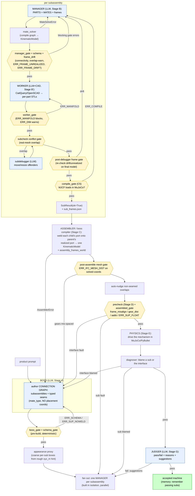

# maker2 Pipeline — Full Workflow, Agent I/O, and Reject Routing

Post boss-compiler refactor (`never-urdf` @ 4db4fc5). Machine prompt in → assembled,
physics-checked, judged machine out. Four LLM agents (boss, manager, worker, judger) plus a
physics diagnoser; everything between them is deterministic Python (compilers + gates).

## 1. End-to-end flow

## 2. What each agent outputs

| Agent | Stage | Input | Output (artifact) | Compiled by |
|---|---|---|---|---|
| **Boss** | A | product prompt | `SubassemblyPlan`: subs (id/brief/frames) + **seams** (`kind`, `mate_type` insert\|seat\|mesh, parent/child frame, `shaft_dia_mm`, `mesh_pair`). No placement coords. → `subassembly_plan.json` | — |
| **Manager** | B | one sub's brief + its **frame contract** (relative frame layout) | connection graph JSON: `parts` (LinkSpec: shape_hint/size_mm/dof), `mates` (MateSpec: mate_type/ports/offset), `frames` (realize each contract frame at a part+port) | `mate_solver.solve_connection_graph` → `KinematicModel` |
| **Worker** | B′ | the sub's `KinematicModel` | per-part CAD scripts + **STL meshes** (`cq/*.py`, `meshes/*.stl`) | CadQuery / OpenSCAD |
| **Subdebugger** | B′ | model + conflict pairs | edited poses/sizes for the 2 offenders | (re-runs worker on changed links) |
| **Assembler** | C | all `SubResult`s + plan | one merged `KinematicModel` + `model.urdf`/`model.mjcf` + `assembly_frames_world` (solved world pose per frame) | pure Python (`_bridge_pose_from_ports`) |
| **Physics diagnoser** | E | assembled MJCF | `{passed, transmission, blamed_sub/interface}` | MuJoCo / PyBullet |
| **Judger** | G | rendered views + prompt | `{"pass": bool, "reasons": str, "suggestions": str}` → `judge.json` | — |

## 3. Gates / prechecks — what they reject and where they route

Every gate is deterministic (no LLM). "Route" = who re-runs on failure.

| Gate | Stage | Blocking codes (reject) | Warn-only | Routes to |
|---|---|---|---|---|
| **schema_gate** | pre-build | malformed plan/model | — | boss / manager (whoever authored) |
| **boss_gate** | pre-build | `ERR_SUP_NOWELD` (a sub reachable only by a power seam — nothing structural holds it) | — | **boss re-plan** |
| **manager_gate** | per-sub | `ERR_CONNECT` (unreachable part), `ERR_FRAME_UNREALIZED`, `ERR_FRAME_DRIFT` (relative layout ≠ contract) | `ERR_OVL` (declared-box overlap — unreliable on non-boxy parts) | **manager re-run** |
| **worker_gate** | per-part | `ERR_MANIFOLD` (non-watertight mesh → sim penetration) | `ERR_DIM` (declared dim absent) | **worker re-run** |
| **subcheck conflict** | per-sub | real-mesh interpenetration ≥ 30% | — | **subdebugger** (then fail up to boss if unresolved) |
| **post-debugger frame gate** | per-sub | `ERR_FRAME_UNREALIZED`, `ERR_FRAME_DRIFT` on the *final* (post-debug) model | — | **manager re-run** |
| **compile_gate (C5)** | per-sub | `ERR_COMPILE` (MJCF won't load in MuJoCo) | — | **manager re-run** |
| **mesh distance (post-assemble)** | C | `ERR_IFC_MESH_DIST` (gear centers, on **solved** `assembly_frames_world`, ≠ sum of pitch radii) | — | **boss re-plan** |
| **precheck** | D | `frame_misalign`, `gear_center_distance`, `aabb_overlap`, `load_error` | — | severity **"interface" → boss**, **"sub" → blamed manager** |
| **assembled_gate** | D | `ERR_SUP_FLOAT` (weld chain doesn't reach root) | `ERR_SUP_GROUND` (orientation-dependent) | **boss re-plan** |
| **physics diagnoser** | E | mechanism doesn't transmit / falls | — | blamed **sub → manager**, else **boss** |
| **judger** | G | `pass:false` | — | **manager re-run** with `suggestions` |

## 4. The reject-routing principle

Two re-entry points, chosen by fault locality:

- **Manager re-run** — the fault is *inside one subassembly* (a part is non-manifold, frames drift within the sub, a gear won't mesh internally, the sub won't compile, the judge dislikes one sub's look). Only that sub rebuilds; the rest are reused from disk.
- **Boss re-plan** — the fault is *at a seam / between subs* (a sub floats with no weld, cross-sub gear centers don't line up, the assembly won't stitch, support chain breaks). The boss re-authors the connection graph; unchanged subs are reused.

The escalation is cheapest-first: a per-part manifold error never triggers a re-plan; a re-plan only fires when no single sub owns the fault.

## 5. Where coordinates still live (post-refactor)

The boss authors **no placement coordinates**. Three numeric survivors, all deliberate:
1. `MountFrame.xyz_m` — a **rough hint** for the appearance proxy only (it runs before any sub is built, so it can't read solved frames). Not used for placement.
2. `instances[k].xyz_m/rpy_rad` — per-copy absolute poses for **repeated identical subs** (N rotors at N poses can't be one port mate).
3. `shaft_dia_mm` — a **diameter**, the sole numeric input keeping gear meshes physical (drives the post-assemble mesh-distance validator).
