<div align="center">
  <a href="https://adam.new/cadam">
    
  </a>
</div>

<div align="center">
  <picture>
    <source media="(prefers-color-scheme: dark)" srcset="./public/Github-Banner-Dark.png">
    <source media="(prefers-color-scheme: light)" srcset="./public/Github-Banner-Light.png">
    
  </picture>
</div>

<h1 align="center"> ⛮ The Open Source Text to CAD Web App ⛮ </h1>

<div align="center">

[](https://github.com/Adam-CAD/cadam/stargazers)
[](https://github.com/Adam-CAD/CADAM/network)
[](https://www.gnu.org/licenses/gpl-3.0)
[](https://nodejs.org/)
[](https://reactjs.org/)
[](https://supabase.com/)
[](https://openscad.org/)
[](https://adam.new)
[](https://discord.com/invite/HKdXDqAHCs)
[](https://x.com/zachdive)
[](https://x.com/aaronhetengli)
[](https://x.com/tsadpbb)

</div>

---

## 🌐 Try it live

**👉 [adam.new/cadam](https://adam.new/cadam)**. Generate a CAD model in seconds, right in your browser. No install required.

## ✨ Features

- 🤖 **AI-Powered Generation** - Transform natural language and images into 3D models
- 🎛️ **Parametric Controls** - Interactive sliders for instant dimension adjustments
- 📦 **Multiple Export Formats** - Export as .STL, .SCAD, or .DXF files
- 🌐 **Browser-Based** - Runs entirely in your browser using WebAssembly
- 📚 **Library Support** - Includes BOSL, BOSL2, and MCAD libraries

## 🎯 Key Capabilities

| Feature                    | Description                                          |
| -------------------------- | ---------------------------------------------------- |
| **Natural Language Input** | Describe your 3D model in plain English              |
| **Image References**       | Upload images to guide model generation              |
| **Real-time Preview**      | See your model update instantly with Three.js        |
| **Parameter Extraction**   | Automatically identifies adjustable dimensions       |
| **Smart Updates**          | Efficient parameter changes without AI re-generation |
| **Custom Fonts**           | Built-in Geist font support for text in models       |

## 📺 Screenshots

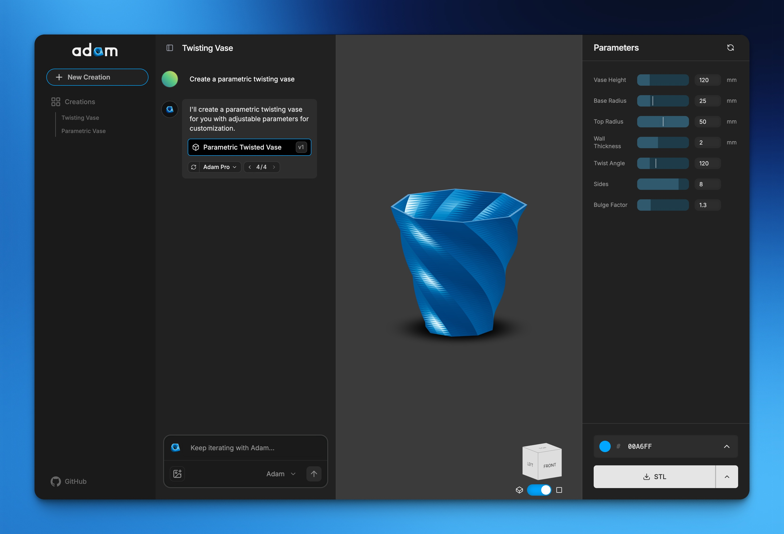

## 🧪 Benchmarks

A showcase of what CADAM builds from a single plain-language description — from full multi-part machines down to clean parametric parts. Each model below started from the prompt shown and came out as fully parametric OpenSCAD, ready to export as `.STL`, `.SCAD`, or `.DXF`. The source and a short write-up for each live in [`benchmarks/`](benchmarks/); the orbiting previews are rendered with [`benchmarks/render.sh`](benchmarks/render.sh).

### Complex machines & assemblies

<table>
  <thead><tr><th>Model</th><th>Prompt</th><th>Controls</th><th>Output</th></tr></thead>
  <tbody>
    <tr>
      <td><a href="benchmarks/13-v8-engine.md"><strong>V8 engine</strong></a></td>
      <td>A complete V8 internal combustion engine: two banks of four cylinders in a 90° V, cylinder heads with ribbed valve covers, an intake manifold in the valley, exhaust headers down each bank, a crankshaft with counterweights, pistons and connecting rods, a front pulley, and an oil pan.</td>
      <td>22 dims<br>8 colors</td>
      <td>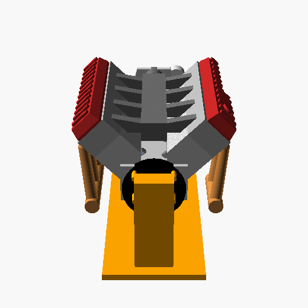</td>
    </tr>
    <tr>
      <td><a href="benchmarks/10-radial-aircraft-engine.md"><strong>9-cylinder radial aircraft engine</strong></a></td>
      <td>Design a 9-cylinder radial aircraft engine: a central round crankcase with nine finned cylinders arranged evenly in a star pattern around it, each cylinder with stacked cooling fins and a domed cylinder head, and a central propeller shaft hub at the front.</td>
      <td>15 dims<br>6 colors</td>
      <td>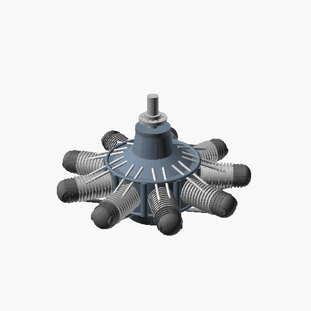</td>
    </tr>
    <tr>
      <td><a href="benchmarks/11-turbofan-jet-engine.md"><strong>Turbofan jet engine</strong></a></td>
      <td>A complete high-bypass turbofan: a front fan you can see into, a bypass cowl, an internal core with compressor/turbine stages, outlet guide vanes, and an exhaust plug.</td>
      <td>2 dims<br>10 colors</td>
      <td>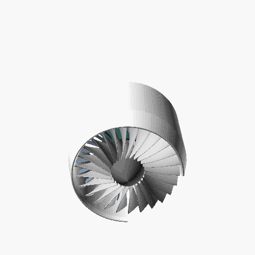</td>
    </tr>
    <tr>
      <td><a href="benchmarks/12-axial-turbine-blisk.md"><strong>Axial turbine blisk</strong></a></td>
      <td>Model an axial-flow turbine blisk (bladed disk) like a jet engine compressor stage: a central hub with a shaft bore and a single ring of about 28 thin aerofoil blades around the rim, each blade clearly twisted along its height from root to tip like a real turbine blade.</td>
      <td>14 dims<br>1 color</td>
      <td>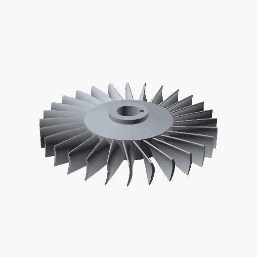</td>
    </tr>
  </tbody>
</table>

### Parametric fundamentals

<table>
  <thead><tr><th>Model</th><th>Prompt</th><th>Controls</th><th>Output</th></tr></thead>
  <tbody>
    <tr>
      <td><a href="benchmarks/01-twisted-hex-vase.md"><strong>Twisted hexagonal vase</strong></a></td>
      <td>Design a twisted hexagonal vase: a hollow shell about 150 mm tall that tapers from a 70 mm base to a 50 mm mouth, with the hexagonal cross-section twisting 120 degrees from bottom to top, a 2 mm wall, and a closed bottom.</td>
      <td>6 dims<br>1 color</td>
      <td>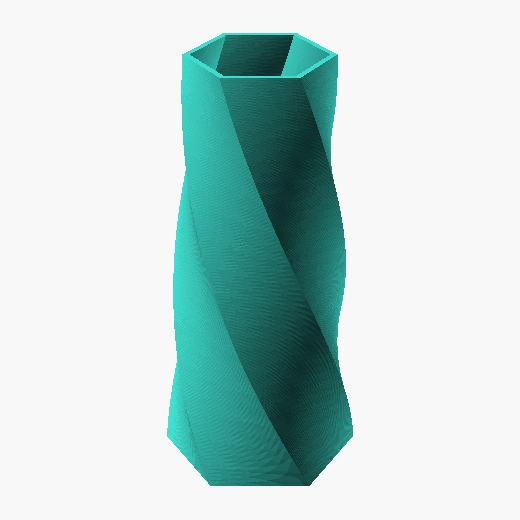</td>
    </tr>
    <tr>
      <td><a href="benchmarks/02-knurled-control-knob.md"><strong>Knurled control knob</strong></a></td>
      <td>Make a knurled control knob 40 mm in diameter and 22 mm tall with a diamond-knurled grip, a raised pointer mark on top, a 6 mm D-shaped shaft bore, and an M3 set-screw hole through the side.</td>
      <td>15 dims<br>2 colors</td>
      <td>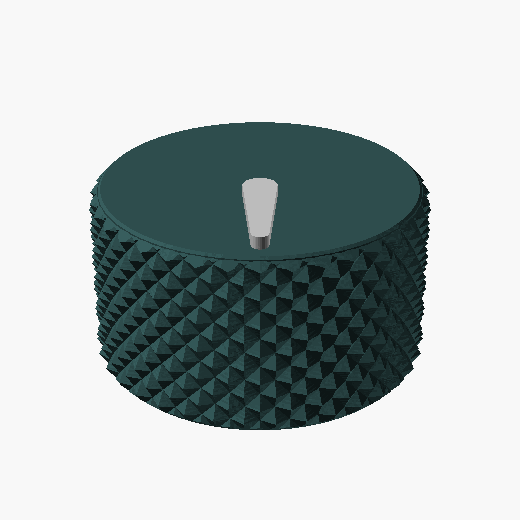</td>
    </tr>
    <tr>
      <td><a href="benchmarks/03-hex-bolt-and-nut.md"><strong>Hex bolt &amp; nut — real threads</strong></a></td>
      <td>Create an M12 hex bolt 45 mm long with a real threaded shaft and a standard hex head, plus its matching hex nut, placed side by side.</td>
      <td>3 dims<br>2 colors</td>
      <td>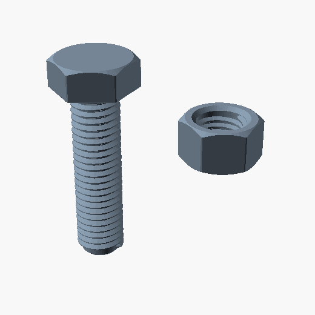</td>
    </tr>
    <tr>
      <td><a href="benchmarks/04-honeycomb-bracket.md"><strong>Honeycomb lightweight bracket</strong></a></td>
      <td>Design a 90-degree angle mounting bracket with 80x80 mm flanges that are 5 mm thick, lightened with a hexagonal honeycomb cutout pattern on both faces, four M5 mounting holes, and a filleted inside corner.</td>
      <td>13 dims<br>1 color</td>
      <td>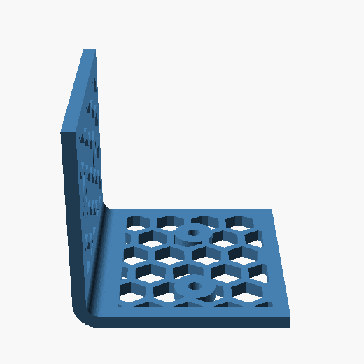</td>
    </tr>
    <tr>
      <td><a href="benchmarks/05-naca-airfoil-wing.md"><strong>NACA 2412 tapered wing</strong></a></td>
      <td>Model a tapered aircraft wing section using a real NACA 2412 airfoil: 120 mm root chord tapering to 80 mm tip over a 200 mm span, with two spanwise spar tubes and a few lightening holes.</td>
      <td>9 dims<br>1 color</td>
      <td>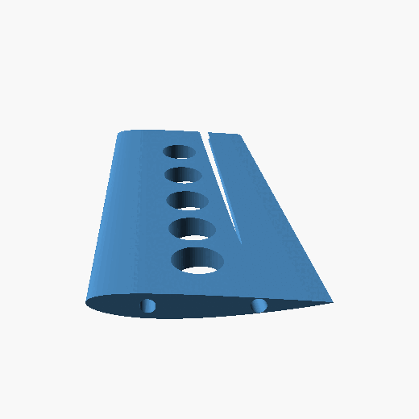</td>
    </tr>
    <tr>
      <td><a href="benchmarks/06-threaded-jar-and-lid.md"><strong>Threaded jar &amp; screw-on lid</strong></a></td>
      <td>Create a small storage jar with external screw threads at the neck and a matching screw-on lid with internal threads. Jar body 60 mm diameter, 70 mm tall, 2.5 mm walls; show the lid unscrewed and sitting beside the jar.</td>
      <td>9 dims<br>2 colors</td>
      <td>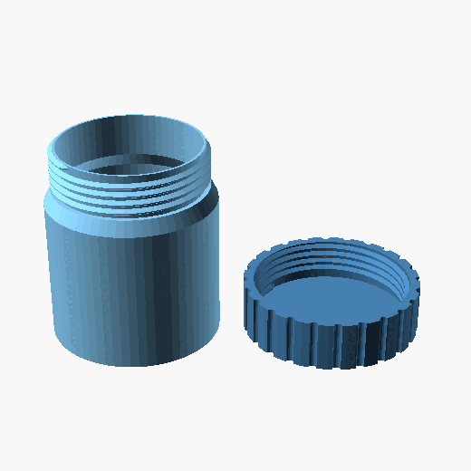</td>
    </tr>
    <tr>
      <td><a href="benchmarks/07-bevel-gear-drive.md"><strong>Right-angle bevel gear drive</strong></a></td>
      <td>Build a right-angle bevel gear drive: a 24-tooth bevel gear on a vertical shaft meshing at 90 degrees with a 16-tooth bevel pinion on a horizontal shaft, each on a short stub shaft.</td>
      <td>9 dims<br>3 colors</td>
      <td>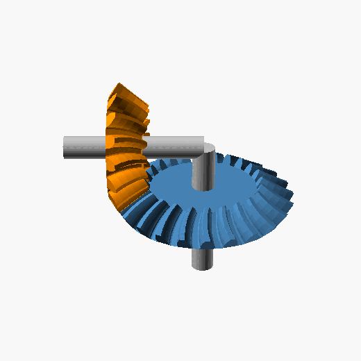</td>
    </tr>
    <tr>
      <td><a href="benchmarks/08-centrifugal-impeller.md"><strong>Centrifugal pump impeller</strong></a></td>
      <td>Design a centrifugal pump impeller: a 90 mm diameter back-plate with a central 12 mm bore and a raised hub, and seven backward-curved blades that sweep from the hub out to the rim, each blade curving smoothly along its path.</td>
      <td>10 dims<br>1 color</td>
      <td>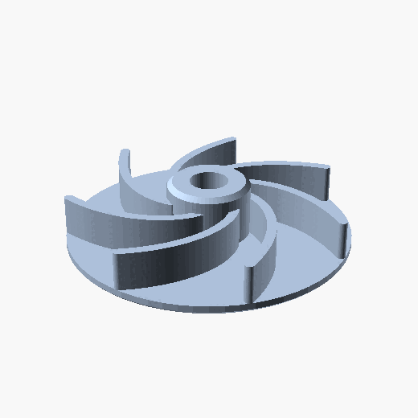</td>
    </tr>
    <tr>
      <td><a href="benchmarks/09-herringbone-planetary-gearbox.md"><strong>Herringbone planetary gear stage</strong></a></td>
      <td>Model a herringbone planetary gear stage at module 1.5: a central sun gear with 18 teeth, three planet gears with 18 teeth each meshing around it, an internal ring gear with 54 teeth, and a carrier plate linking the three planet axles. Color the sun, planets, ring, and carrier differently.</td>
      <td>10 dims<br>4 colors</td>
      <td>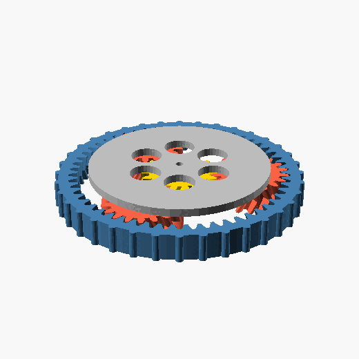</td>
    </tr>
  </tbody>
</table>

## 🚀 Quick Start

```bash
# Clone the repository
git clone https://github.com/Adam-CAD/CADAM.git
cd CADAM

# Install dependencies
npm install

# Start Supabase
npx supabase start
npx supabase functions serve --no-verify-jwt

# Start the development server
npm run dev
```

## 📋 Prerequisites

- Node.js ^20.19.0 or >=22.12.0, with npm 10+
- Supabase CLI
- ngrok (for local webhook development)

## 🔧 Setting Up Environment Variables

### 1. Frontend Environment:

- Copy `.env.local.template` to `.env.local`
- Update all required keys in `.env.local`:
  ```
  VITE_SUPABASE_ANON_KEY="<Test Anon Key>"
  VITE_SUPABASE_URL='http://127.0.0.1:54321'
  ```

### 2. Server Environment:

- Add server-side keys to `.env.local`, including:
  ```
  ANTHROPIC_API_KEY="<Test Anthropic API Key>"
  OPENROUTER_API_KEY="<Test OpenRouter API Key>"
  OPENAI_API_KEY="<Test OpenAI API Key>"
  GOOGLE_API_KEY="<Test Google API Key>"
  FAL_KEY="<Test FAL API Key>"
  SUPABASE_SERVICE_ROLE_KEY="<Test Service Role Key>"
  BILLING_SERVICE_URL="<Test Billing Service URL>"
  BILLING_SERVICE_KEY="<Test Billing Service Key>"
  ENVIRONMENT="local"
  ADAM_URL="<Adam URL or dev URL>" # Checkout and portal redirect target
  WEBHOOK_BASE_URL="<Public TanStack App URL>" # Your app URL for /cadam/api callbacks
  NGROK_URL="<NGROK URL>" # Optional local Supabase Storage tunnel for provider-readable signed URLs
  ```

## 🌐 Setting Up ngrok for Local Development

CADAM uses public URLs for provider callbacks and local signed storage URLs:

1. Install ngrok if you haven't already:

   ```bash
   npm install -g ngrok
   # or
   brew install ngrok
   ```

2. Start an ngrok tunnel pointing to your TanStack Start dev server:

   ```bash
   ngrok http 3000
   ```

3. Copy the generated ngrok URL (e.g., https://xxxx-xx-xx-xxx-xx.ngrok.io) and add it to your `.env.local` file:

   ```
   WEBHOOK_BASE_URL="https://xxxx-xx-xx-xxx-xx.ngrok.io"
   ```

4. If a provider must fetch local Supabase Storage signed URLs, run a second tunnel to Supabase and set `NGROK_URL` to that URL.

5. Ensure `ENVIRONMENT="local"` is set in the same file.

## 💻 Development Workflow

### Install Dependencies

```bash
npm i
```

### Start Supabase Services

```bash
npx supabase start
npm run dev
```

## 🛠️ Built With

- **Frontend:** React 19 + TypeScript + TanStack Start + Vite
- **3D Rendering:** Three.js + React Three Fiber
- **CAD Engine:** OpenSCAD WebAssembly
- **Backend:** TanStack Start server routes + Supabase PostgreSQL/Auth/Storage
- **AI:** Anthropic Claude API
- **Styling:** Tailwind CSS + shadcn/ui
- **Libraries:** BOSL, BOSL2, MCAD

## 🤝 Contributing

If you have a suggestion that would make this better, please fork the repo and create a pull request. You can also [open an issue](https://github.com/Adam-CAD/CADAM/issues).

See the [CONTRIBUTING.md](CONTRIBUTING.md) for instructions and [code of conduct](CODE_OF_CONDUCT.md).

## 🙏 Credits

This app wouldn't be possible without the work of:

- [OpenSCAD](https://github.com/openscad/openscad)
- [openscad-wasm](https://github.com/openscad/openscad-wasm)
- [openscad-playground](https://github.com/openscad/openscad-playground)
- [openscad-web-gui](https://github.com/seasick/openscad-web-gui)
- [dingcad](https://github.com/yacineMTB/dingcad)

## 📄 License

This distribution is licensed under the GNU General Public License v3.0 (GPLv3). See `LICENSE`.

Components and attributions:

- Portions of this project are derived from `openscad-web-gui` (GPLv3).
- This distribution includes unmodified binaries from OpenSCAD WASM under
  GPL v2 or later; distributed here under GPLv3 as part of the combined work.
  See `src/vendor/openscad-wasm/SOURCE-OFFER.txt`.

---

## 🌟 Star History

<div align="center">

<a href="https://www.repostars.dev/?repos=Adam-CAD%2FCADAM&theme=forest">
  
</a>

<sub>Live chart by <a href="https://www.repostars.dev/?repos=Adam-CAD%2FCADAM&theme=forest">RepoStars</a> — click for the interactive version.</sub>

</div>

---

<div align="center">
  
**⭐ If you find CADAM useful, please consider giving it a star!**

[](https://github.com/Adam-CAD/cadam/stargazers)

Made with 💙 for the 3D printing and CAD community

</div>
